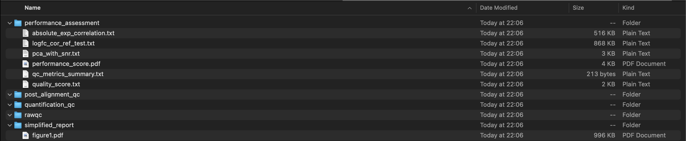

# Quartet RSeQC Report

Quartet RSeQC Report is a quality assessment tool for RNA-seq data. It contains two parts: workflow and report. The workflow command takes raw reads (in FASTQ format), produces a set of qc result files from them. and you can use report command to report the results finally. We strongly recommend you to use the whole pipeline with docker to analyze your raw data and generate the report. See [Whole pipeline](#how-to-run-quartet-rseqc-report-whole-pipeline) for more details. If you only want to generate the report from the expression table, see [Only report](#how-to-generate-quartet-rseqc-report-from-the-expression-table-only-report) for more details.

## For users [Recommended]

### How to run Quartet RSeQC Report [Whole pipeline]

see more details on [QDP Docs](https://docs.chinese-quartet.org/data_pipelines/transcriptomics/intro/).


### How to generate Quartet RSeQC Report from the expression table [Only report]

#### STEP1: Pull docker image

you need to get the tag name from [here](https://github.com/chinese-quartet/quartet-rseqc-report/pkgs/container/quartet-rseqc-report), and replace the `[tag_name]` with the tag name. such as `v0.2.4-15cd635b`

```
docker pull ghcr.io/chinese-quartet/quartet-rseqc-report:[tag_name]
```

#### STEP2: Run docker image

We assume you have the folloing files in the /report directory which is mounted to the docker container.

```
docker run -v <your-local-directory>:/report  --entrypoint bash -it ghcr.io/chinese-quartet/quartet-rseqc-report:[tag_name]

# If you get a bash shell like this, it means you have successfully run the docker image
# root@af1ae467b246:/data#
```

#### STEP3: Run exp2qcdt to deal with the expression table

> NOTE: 
> 1. We assume you have the following files in the /report directory: `fpkm.csv`, `count.csv`, `metadata.csv`
> 2. You must be sure that you are in the docker container

The `fpkm.csv` and `count.csv` are the expression table, and the `metadata.csv` is the phenotype table.

Get the example files from here: [`fpkm.csv`](./examples/exp2qcdt/fpkm.csv), [`count.csv`](./examples/exp2qcdt/count.csv), [`metadata.csv`](./examples/exp2qcdt/metadata.csv)

```
mkdir /report/output
bash /venv/bin/exp2qcdt.sh -e /report/fpkm.csv -c /report/count.csv -m /report/metadata.csv -o /report/output
```

After the above command, you will get the following files in the `/report/output` directory in the docker container or <your-local-directory>/output directory in your local machine.



#### STEP4: Run multiqc to generate the report

```
multiqc /report/output -t quartet_rnaseq_report
```

After the above command, you will get the final report file `multiqc_report.html` in the `/report/output` directory in the docker container or <your-local-directory>/output directory in your local machine.


## For developers
### Build docker image [Recommended]

You need to install [Docker](https://docs.docker.com/get-docker/) first.

```bash
git clone https://github.com/chinese-quartet/quartet-rseqc-report

cd quartet-rseqc-report

bash build-docker.sh

# After build docker image, you can run the docker image
docker run -it --rm quartet-rseqc-report:<tag_name> --help
```

### Build from source code [Not recommended]

#### Prerequisite

- Bash
- Python3 >= 3.7
- pip3
- Java
- R >= 3.6.3

```
# For Linux
conda create -c conda-forge -c bioconda -c anaconda -n quartet-rseqc-report python=3.9 openjdk=8.0.312 r-base=3.6.3 blas lapack cxx-compiler conda-pack gfortran_linux-64

# For Mac
conda create -c conda-forge -c bioconda -c anaconda -n quartet-rseqc-report python=3.9 openjdk=8.0.312 r-base=3.6.3 blas lapack cxx-compiler conda-pack
```

#### Installation

```
# Activate conda environment
conda activate quartet-rseqc-report

# Clone the repo
git clone https://github.com/chinese-quartet/quartet-rseqc-report

cd quartet-rseqc-report

# Build the environment and compile the quartet-rseqc-report
make all
```

#### Usage

```bash
source .env/bin/activate
java -jar target/uberjar/quartet-rseqc-report-*-standalone.jar -h
```

## For QDP developers [Plugin Mode]

### Prerequisite

Please access [Quartet Service](https://github.com/chinese-quartet/quartet-service) for more details

### Installation

```bash
copm-cli install -n quartet-rseqc-report -V v0.2.4 -d plugins
```

## Contributions

Quartet QC Report for RNA-Seq Data developed by [Jun Shang](https://github.com/stead99) <[exp2qcdt](./exp2qcdt) & [report](./report)>

## License

Copyright © 2021

This program and the accompanying materials are made available under the
terms of the Eclipse Public License 2.0 which is available at
http://www.eclipse.org/legal/epl-2.0.

This Source Code may also be made available under the following Secondary
Licenses when the conditions for such availability set forth in the Eclipse
Public License, v. 2.0 are satisfied: GNU General Public License as published by
the Free Software Foundation, either version 2 of the License, or (at your
option) any later version, with the GNU Classpath Exception which is available
at https://www.gnu.org/software/classpath/license.html.
